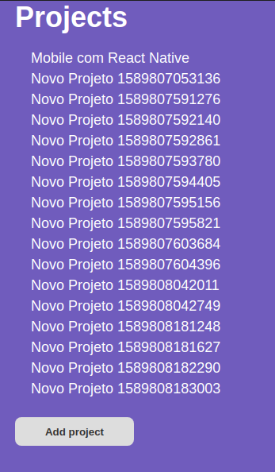

# Front-end com ReactJs

Now, we gonna continue our journey knowing some concepts of Reactjs. We gonna create our first project frontend project and connect it with our backend created in the last module.

## How to run

1. `git clone` this repository
2. Make sure you have `yarn` installed
3. Make sure you have `API` from https://github.com/ivanvinicius/2020-bootcamp-backend-com-nodejs downloaded and running 
4. Inside project folder run the command `$ yarn` to download dependencies
5. Run the project with `$ yarn dev`
6. To create a build of project run the command `$ yarn build`

## Project Overview

### keep coding!